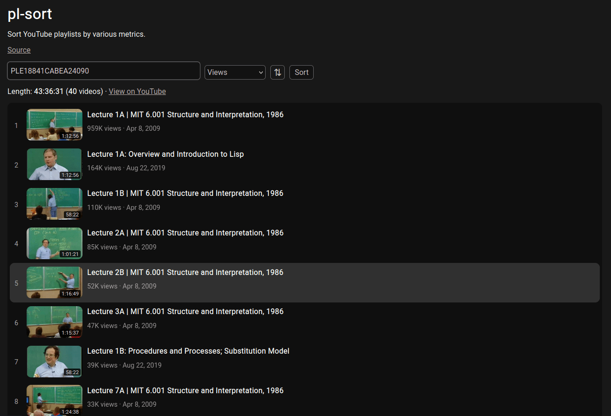

# pl-sort

[pl-sort](https://pl-sort.netlify.app) lets you sort public YouTube playlists by views, duration, like count, comment count, date published, and video title. It also shows the total duration of a playlist.

